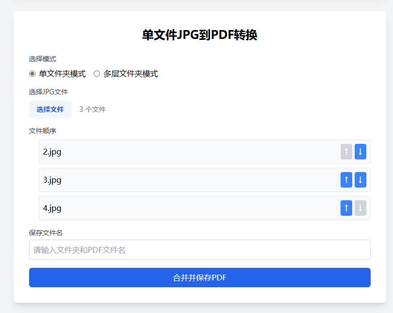
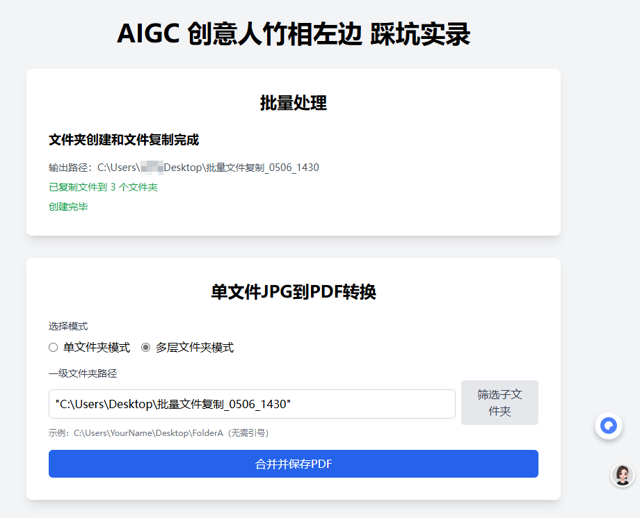

```

jpg2pdf/
├── app.py               # Flask 应用程序的主文件，包含路由、视图函数等核心逻辑。
├── utils/               # 存放实用工具函数的目录
│   ├── file_utils.py    # 包含文件操作相关的实用函数，例如创建文件夹、复制文件等。
│   └── pdf_utils.py     # 包含 PDF 处理相关的实用函数，例如合并 JPG 图片为 PDF 等。
├── templates/           # 存放 HTML 模板文件的目录，用于前端页面的渲染
│   └── index.html       # 应用程序的首页 HTML 文件，包含用户界面结构。
├── static/              # 存放静态资源的目录，例如 CSS、JavaScript、图片等
│   ├── styles.css       # 应用程序的样式表文件，控制页面的外观。
│   ├── script.js        # 应用程序的主要 JavaScript 文件，处理前端交互逻辑。
│   └── batch.js         # 可能包含用于批量处理功能的 JavaScript 代码。
├── README.md            # 项目的说明文件，通常包含项目简介、使用方法、安装步骤等。
├── .gitignore           # 指定 Git 版本控制系统应该忽略的文件和目录，例如虚拟环境、临时文件等。
├── requirements.txt     # 列出项目依赖的 Python 包及其版本，用于安装项目所需的运行环境。
├── venv/                # Python 的虚拟环境目录，用于隔离项目的依赖，避免与其他项目冲突。

```



JPG to PDF Converter
一个基于Python和Flask的Web工具，支持单文件和批量JPG到PDF转换。
功能
单文件转换

选择多个JPG文件，显示文件名列表，支持上下移动调整顺序。
输入保存文件名，自动创建同名文件夹和PDF文件。
保存到桌面（带时间戳，如myfile_20250219_123456/myfile.pdf）。

批量处理

上传TXT文件（每行一个人员名字）。
创建个人文件夹，复制指定文件夹的文件到每个人的文件夹。
手动选择每个人的文件夹，合并其中的JPG为PDF，保存到桌面（文件名为人名）。

环境要求

Python 3.8+
虚拟环境（推荐）
依赖：Flask, img2pdf, Pillow

安装

克隆或下载项目到本地。
导航到项目目录：cd jpg2pdf


创建并激活虚拟环境：python -m venv venv
.\venv\Scripts\activate


安装依赖：pip install -r requirements.txt


运行

确保虚拟环境已激活。
运行Flask应用：python app.py


打开浏览器：
单文件转换：http://127.0.0.1:5000
批量处理：http://127.0.0.1:5000/batch


使用

单文件转换：
选择JPG文件，调整顺序，输入保存文件名。
点击“合并并保存PDF”。


批量处理：
上传包含人员名字的TXT文件。
输入源文件夹路径（如D:\data）。
点击“创建文件夹和复制文件”。
手动输入每个人的文件夹路径，点击“合并”生成PDF。


注意事项

仅支持标准JPG文件（.jpg/.jpeg）。
批量处理支持常见文件格式（JPG, PNG, PDF, DOCX, TXT等）复制。
输出文件夹和PDF保存在桌面，批量文件夹带时间戳。

贡献
欢迎提交Issue或Pull Request！
许可证
MIT License
